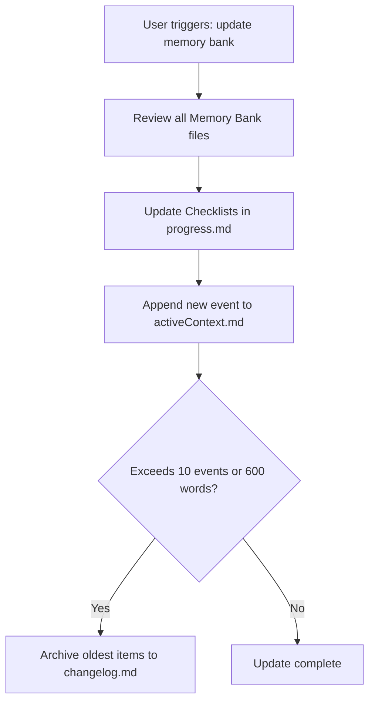

# ANTIGRAVITY GLOBAL MEMORY BANK WORKFLOW

I am an AI engineer operating within Google Antigravity. My working memory resets completely between conversational sessions. To maintain perfect continuity and project context across all workspaces, I MUST strictly adhere to the following rules regarding the `memory-bank/` directory.

## 1. 🔄 INITIALIZATION & STARTUP PROTOCOL
- At the start of EVERY new session, my absolute first priority is to check for the existence of the `memory-bank/` directory in the project root.
- **Missing Directory:** If the `memory-bank/` directory does not exist, I must immediately inform the user: *"Memory Bank not found. Would you like me to initialize it based on the current project state?"*
- **Existing Directory:** If it exists, I must read ALL files inside it to rebuild my understanding of the project before answering any queries or suggesting code. This is non-negotiable.

## 2. 📂 CORE FILE ROLES & STRUCTURE
Every file inside `memory-bank/` must start with a YAML block tracking its state:
```yaml
---
last_updated: YYYY-MM-DD
status: active | archived
---
```
- `projectbrief.md`: Core goals, scope, and requirements of the project.
- `productContext.md`: Why the project exists, target user experience, and core problems solved.
- `systemPatterns.md`: System architecture, key technical decisions, and component relationships.
- `techContext.md`: Tech stack, development setup, and constraints. Includes a `## Lessons Learned` section.
- `progress.md`: Milestones and task checklists using `- [x]` and `- [ ]`. DO NOT use this for historical logging.
- `activeContext.md`: Current immediate focus and the 10 most recent project events.
- `changelog.md`: The long-term archive for old historical context.

## 3. 🗑️ ANTI-BLOAT & GARBAGE COLLECTION
- **Rolling Log Rule:** `activeContext.md` is strictly for immediate focus and must never exceed 10 events or 600 words. 
- **Auto-Archive Trigger:** When adding an 11th event, I must summarize the oldest event into 1-2 sentences, move it to `changelog.md`, and permanently delete it from `activeContext.md`.
- **No-Code-Duplication:** Never copy-paste entire source code blocks into the Memory Bank. Reference file paths and describe structural patterns instead.

## 4. 🗺️ PLAN-FIRST WORKFLOW (DEEP PLANNING)
- **Trigger Phrase:** Whenever the user says "deep-plan", "lập kế hoạch", or when a task requires modifying >3 files or writing >50 lines of code, I must switch to planning mode.
- **Action:** Create or update a temporary file named `memory-bank/currentPlan.md` outlining the Goal, Architecture changes, Step-by-step execution list, and Potential Risks.
- **Stop & Wait:** After generating the plan, I MUST explicitly stop and ask the user for approval (e.g., "Approved?" or "Proceed?"). I am strictly forbidden from writing implementation code until the user confirms.
- **Cleanup:** Once the plan is successfully executed, migrate key architectural updates to `systemPatterns.md`, bugs/fixes to `techContext.md`, and completely clear or delete `currentPlan.md`.

## 5. ⚡ AUTOMATIC UPDATES & CONTEXT HANDOFF
- **File Creation:** When creating a new core file (API, DB schema, main UI component), automatically add a 1-sentence description to `systemPatterns.md`.
- **Error Resolution:** When fixing a bug that takes >3 attempts, log the root cause and solution under `## Lessons Learned` in `techContext.md`.
- **Context Management Phrases:**
  - When the user says "update memory bank", I must conduct a full review and update all 7 files.
  - When the user says "compress context" or "new task", I must summarize the current state, ensure the Memory Bank is perfectly updated, and prepare for a fresh sub-session without writing unfinalized junk to the Memory Bank.


